# Modelo relacional

Este diagrama mostra o caminho principal. Tabelas auxiliares foram omitidas para não deixar o desenho ilegível.

```mermaid
erDiagram
    BUSINESSES ||--o{ BUSINESS_MEMBERS : has
    BUSINESSES ||--o{ PROFESSIONALS : has
    BUSINESSES ||--o{ CLIENTS : has
    BUSINESSES ||--o{ SERVICES : offers
    BUSINESSES ||--o{ APPOINTMENTS : owns
    BUSINESSES ||--o{ EXPENSES : records
    BUSINESSES ||--o{ PRODUCTS : sells

    CLIENTS ||--o{ APPOINTMENTS : books
    CLIENTS ||--o{ CLIENT_PREFERENCES : has
    CLIENTS ||--o{ CLIENT_MEDIA : has
    CLIENTS ||--o{ RECEIVABLES : owes
    CLIENTS ||--o{ ORDERS : buys
    CLIENTS ||--o{ PROSTHESIS_CASES : has

    PROFESSIONALS ||--o{ APPOINTMENTS : performs
    PROFESSIONALS ||--o{ SCHEDULE_BLOCKS : blocks
    SERVICES ||--o{ APPOINTMENTS : defines
    SERVICES ||--o{ SERVICE_ADDON_LINKS : accepts
    SERVICE_ADDONS ||--o{ SERVICE_ADDON_LINKS : belongs

    RECURRENCE_SERIES ||--o{ RECURRENCE_PATTERN_ITEMS : pattern
    RECURRENCE_SERIES ||--o{ APPOINTMENTS : generates

    WAITING_LIST_ENTRIES ||--o{ WAITING_LIST_OFFERS : offers
    APPOINTMENTS ||--o{ PAYMENTS : receives
    APPOINTMENTS ||--o{ APPOINTMENT_ADJUSTMENTS : adjusts

    PRODUCTS ||--o{ INVENTORY_MOVEMENTS : ledger
    ORDERS ||--o{ ORDER_ITEMS : contains
    PRODUCTS ||--o{ ORDER_ITEMS : sold

    RECEIVABLES ||--o{ RECEIVABLE_ENTRIES : ledger
    RECEIVABLES ||--o{ PAYMENTS : receives

    PROSTHESIS_CASES ||--o{ PROSTHESIS_MAINTENANCE : tracks
    QUOTES ||--o{ QUOTE_ITEMS : contains
```



## Integridade multiempresa

Um relacionamento não depende apenas do UUID filho. Exemplo conceitual:

```sql
foreign key (business_id, client_id)
references clients (business_id, id)
```

Assim, mesmo que um bug envie IDs errados, o banco rejeita uma relação entre empresas diferentes.

## Conflito de agenda

A tabela `appointments` possui uma exclusion constraint com `tstzrange`. Dois atendimentos ativos não podem ocupar intervalos sobrepostos para o mesmo profissional.

A função `is_time_slot_available` também considera `schedule_blocks`, permitindo consultar a disponibilidade antes de tentar gravar o atendimento.
